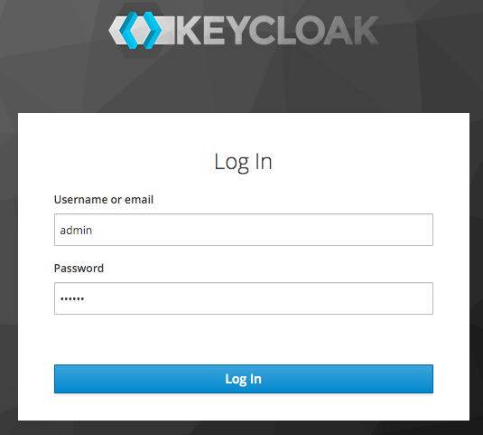
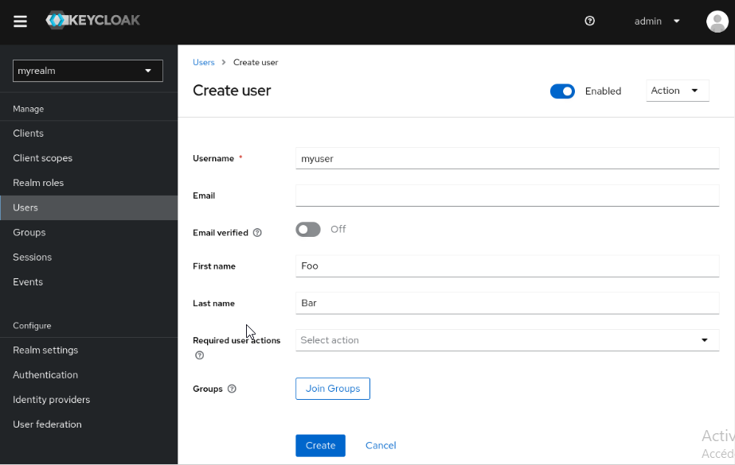
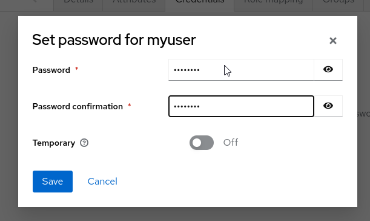
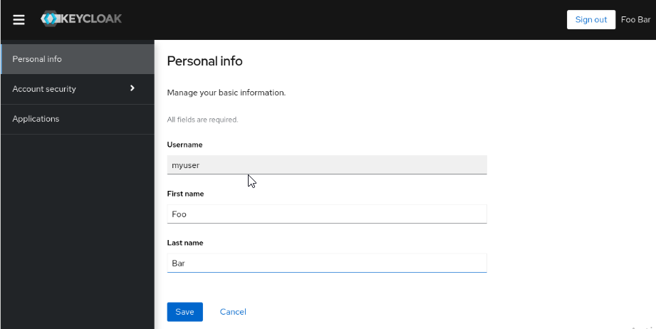
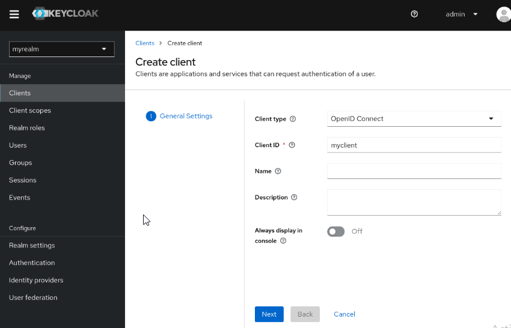
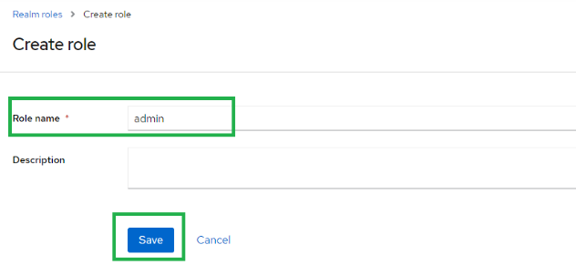
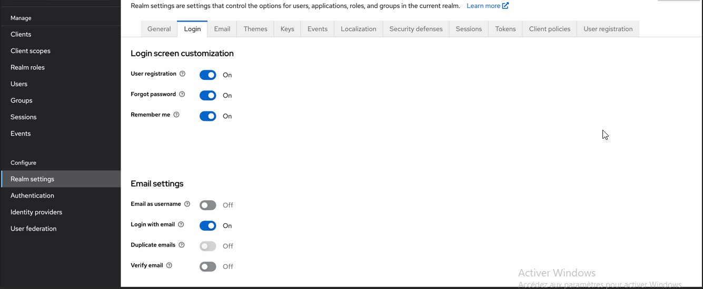
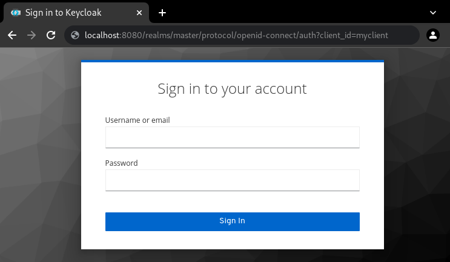

# Spring project with angular and thymeleaf activity 7.
---------------------------------------
### Before you start
+ Download Keycloak
+ Download and extract keycloak.zip from the Keycloak website.
+ After extracting this file, you should have a directory that is named keycloak.
+ On Windows, run: bin\kc.bat start-dev
## Create an admin user
+ Keycloak has no default admin user. You need to create an admin user before you can start Keycloak.
+ Open http://localhost:8080/.
+ Fill in the form with your preferred username and password.
## Log in to the Admin Console
+ Go to the Keycloak Admin Console.
+ Log in with the username and password you created earlier.
## Create a user

+ To secure the first application, you start by registering the application with your Keycloak instance:

### Create a role 

+ Authorization 

### Sign in on keycloak
